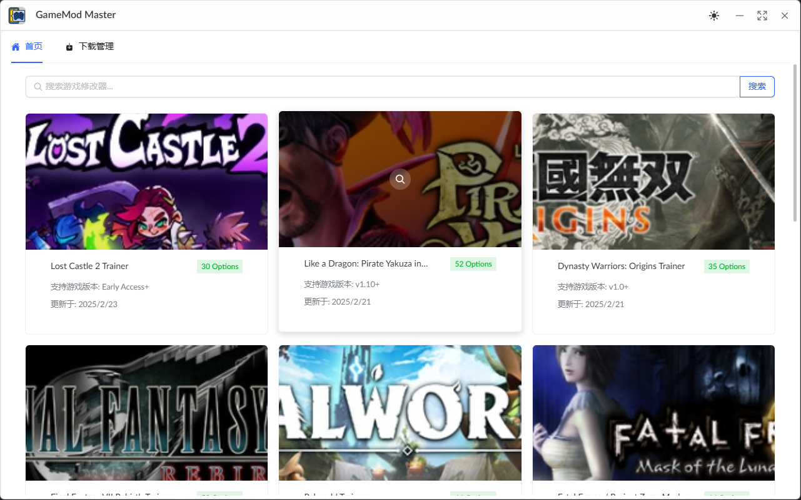

# GameModMaster (游戏修改器大师)

<div align="center">


[](https://github.com/xinggaoya/GameModMaster/blob/main/LICENSE)
[](https://github.com/xinggaoya/GameModMaster/stargazers)
[](https://github.com/xinggaoya/GameModMaster/issues)

</div>

## 📸 预览

<div align="center">
  
</div>

## 📝 项目介绍

GameModMaster 是一个强大的风灵月影游戏修改器管理工具，使用 Tauri + Vue 3 + TypeScript 开发。它提供了一个现代化的界面来管理和使用各种游戏修改器，让游戏体验更加丰富多彩。

### ✨ 主要特性

- 🎮 支持多种游戏修改器管理
- 🔒 安全的修改器运行环境
- 🌈 美观的用户界面
- 🚀 高性能的本地应用
- 💾 本地数据存储
- 🔄 自动更新功能

## 🛠️ 技术栈

- [Tauri](https://tauri.app/) - 构建跨平台应用
- [Vue 3](https://vuejs.org/) - 前端框架
- [TypeScript](https://www.typescriptlang.org/) - 类型安全
- [Naive UI](https://www.naiveui.com/) - UI 组件库
- [Vite](https://vitejs.dev/) - 构建工具
- [Pinia](https://pinia.vuejs.org/) - 状态管理

## 📦 安装

```bash
# 克隆项目
git clone https://github.com/xinggaoya/GameModMaster.git

# 进入项目目录
cd GameModMaster

# 安装依赖
pnpm install

# 启动开发服务器
pnpm tauri dev

# 构建生产版本
pnpm tauri build
```

## 🚀 使用指南

1. 下载并安装最新版本
2. 启动应用程序
3. 添加你的游戏修改器
4. 享受游戏吧！

## 🤝 贡献指南

欢迎提交 Pull Request 或创建 Issue！

1. Fork 本仓库
2. 创建你的特性分支 (`git checkout -b feature/AmazingFeature`)
3. 提交你的更改 (`git commit -m 'Add some AmazingFeature'`)
4. 推送到分支 (`git push origin feature/AmazingFeature`)
5. 打开一个 Pull Request

## 📄 许可证

本项目使用 [MIT](LICENSE) 许可证 - 查看 [LICENSE](LICENSE) 文件了解详情

## 👨‍💻 作者

[@xinggaoya](https://github.com/xinggaoya)

## 🙏 鸣谢

- [Tauri](https://tauri.app/)
- [Vue.js](https://vuejs.org/)
- [Naive UI](https://www.naiveui.com/)

## 自动更新功能

GameModMaster现在支持自动检查和安装更新。

### 功能特点

- 应用启动时自动检查更新
- 可以手动检查更新
- 下载更新时显示进度条
- 支持阅读发布说明
- 下载完成后自动启动安装程序

### 实现细节

自动更新功能通过以下方式实现：

1. 检查GitHub Releases接口获取最新版本信息
2. 比较当前版本和最新版本
3. 下载更新并在后台安装

### 版本发布

发布新版本时需要：

1. 在GitHub创建新的Release
2. 上传可执行文件(.exe)
3. 添加清晰的发布说明

---

如果这个项目对你有帮助，请给它一个 ⭐️
